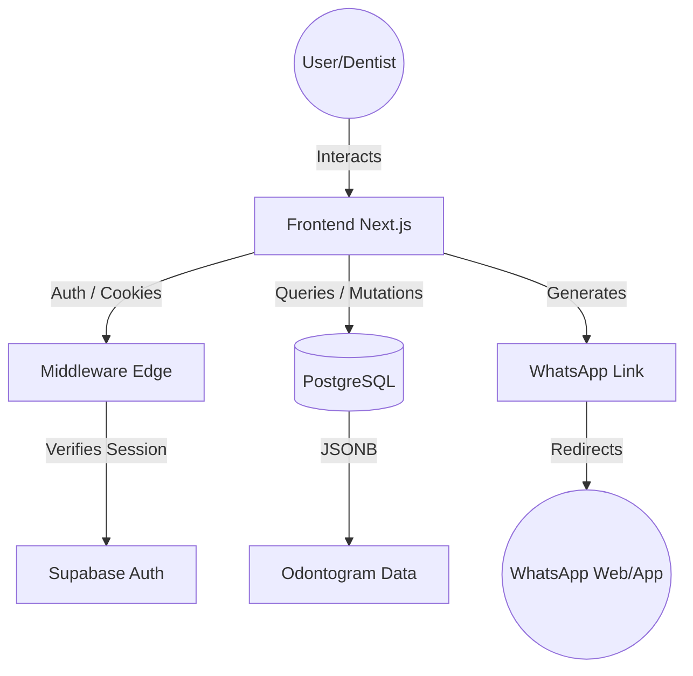

# 🦷 DentalCloud: High-Performance Patient Management for Modern Practices

A specialized SaaS for dental management built with a focus on real-time scheduling, interactive clinical visual records, and a zero-cost infrastructure.

## 🌟 About the Developer
Hello! I'm **Ezequiel Ranieri**. I am a self-taught developer who discovered the world of programming through curiosity and a passion for building things. Everything I know—from architecture patterns to distributed systems—I've learned on my own through books, technical documentation, videos, and endless hours of practice.

I created this project to consolidate and demonstrate my understanding of software development. I don't claim to be a senior architect; I am a dedicated learner who enjoys solving complex technical challenges and building robust software that works under pressure.

**Contact:**
- **Email:** ez.ranieri@gmail.com
- **GitHub:** https://github.com/ezequielranieri
- **LinkedIn:** https://www.linkedin.com/in/ezequielranieri/

---

## 🎯 Why this project?
I built this project to bridge the gap between complex, expensive dental software and the manual paper-based systems many small practices still use. My technical goal was to explore the synergy between Next.js 16's App Router and Supabase, specifically focusing on how to manage complex relational data like clinical histories and interactive SVG states (the Odontogram) while maintaining a strict, cookie-based authentication flow at the edge.

## 🏗 System Architecture / Data Flow
My architecture focuses on data integrity and real-time updates using a modern full-stack approach:

1.  **Session Security**: A custom middleware intercepts requests at the edge to validate Supabase Auth sessions before rendering any protected routes.
2.  **State Orchestration**: The App Router handles the hierarchy of patients and their histories, passing IDs down to specialized client components.
3.  **Visual Interaction**: An SVG-based Odontogram component manages local state for 32 teeth across multiple surfaces, synchronizing changes to a JSONB field in PostgreSQL.
4.  **Backend Integration**: Supabase provides the PostgreSQL backbone, utilizing Row Level Security (RLS) to ensure that even with an "anon" key, data remains isolated and secure.
5.  **External Integration**: I implemented a lightweight WhatsApp integration that generates dynamic `wa.me` links for instant patient notifications without the overhead of a paid API.



## 🛠 Tech Stack
- **Next.js 16**: My core framework for server-side rendering, routing, and API orchestration.
- **React 19**: Used for building the interactive UI and managing complex component lifecycles.
- **Supabase**: My Backend-as-a-Service for real-time PostgreSQL, Authentication, and RLS.
- **Tailwind CSS 4**: For high-performance, utility-first styling using modern CSS variables.
- **TypeScript**: The foundation of my codebase, ensuring type safety across the entire domain.
- **Lucide React**: My choice for a clean, consistent, and lightweight icon system.

---

## 🚀 Quick Start Guide
To get this running on your local machine:

### Prerequisites
- Node.js (Latest LTS recommended)
- A Supabase account and project

### Setup
1.  **Clone and Install**:
    ```bash
    git clone https://github.com/ezequielranieri/dentalcloud
    cd dentalcloud
    npm install
    ```
2.  **Environment Variables**: Create a `.env.local` file in the root:
    ```env
    NEXT_PUBLIC_SUPABASE_URL=your_supabase_url
    NEXT_PUBLIC_SUPABASE_ANON_KEY=your_supabase_anon_key
    ```
3.  **Database Migration**: Run the SQL scripts found in `supabase/migrations/` in your Supabase SQL Editor to set up the tables and RLS policies.

### Run
```bash
npm run dev
```

## 💡 Usage / Endpoints
The application is designed as a centralized dashboard:
*   **/agenda**: The primary workspace for daily appointment management and status tracking.
*   **/pacientes**: A searchable directory of all registered patients and their contact details.
*   **/pacientes/[id]/historia**: A specialized editor where I can log new clinical sessions and update the visual Odontogram state.
*   **/login**: Secure entry point managed via Supabase SSR.

---

## 🧠 What I Learned
Developing this project was a significant milestone in my transition to full-stack JavaScript. I mastered the mental model of React's "lifting state up" and the intricacies of Next.js middleware for secure, cookie-based authentication.

However, reviewing the code today with a more mature perspective, I've identified several areas for improvement:
*   **Data Fetching Strategy**: I relied heavily on client-side fetching within `useEffect` hooks. Today, I would refactor this to use **Server Components** for initial data loading to improve SEO and drastically reduce the "loading spinner" phase.
*   **State Coupling**: The business logic for calculating tooth surfaces is tightly coupled with the UI in `Odontograma.tsx`. I would now extract this into a custom `useOdontogram` hook or a pure utility library to make it testable and reusable.
*   **Error Boundaries**: My current error handling is somewhat silent (logging to the console). I would implement a robust **Toast notification system** and React Error Boundaries to provide a better user experience when network issues occur.
*   **Type Centralization**: I noticed some type duplication between my library files and components. I would consolidate all domain models into a single `/types` directory to ensure a single source of truth.

## 🗺 Roadmap
- [ ] Migrate `fetchData` logic to Next.js Server Actions for better security and performance.
- [ ] Implement a "Financial Module" to track payments and pending balances per patient.
- [ ] Add support for uploading and viewing dental X-rays (DICOM/Images) using Supabase Storage.

Thank you for checking out my work! I'm always open to feedback and looking for new opportunities to learn and grow.
